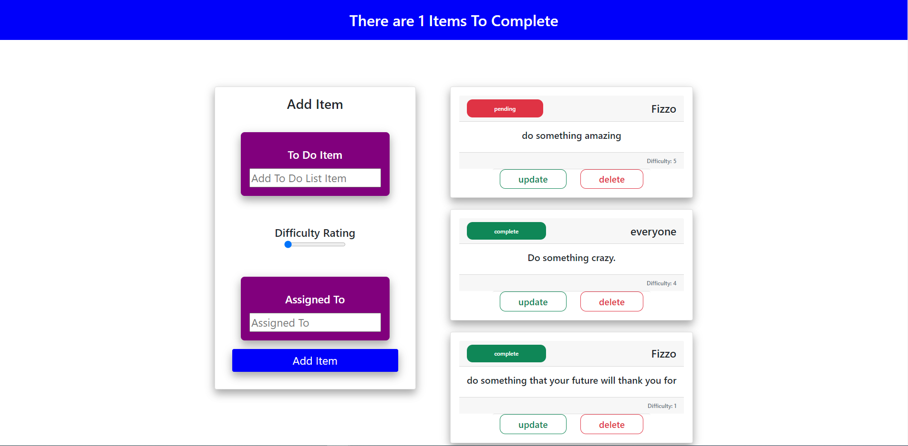
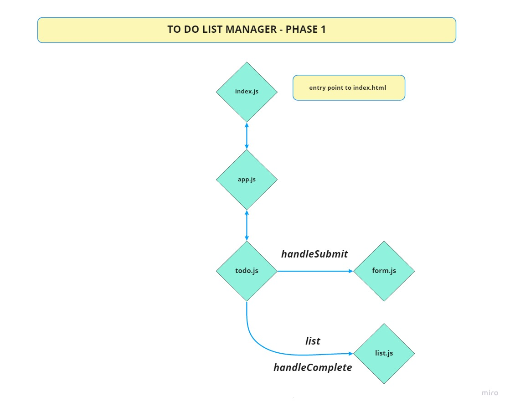
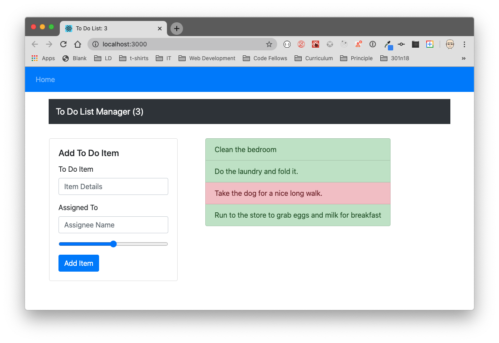

# To Do List Manager

To Do List Manager using react - built in 4 phases. A Web Application for securely managing a To Do List

## Author: Fizzo Pannosch

**Version**: 1.1.0

<!-- (increment the patch/fix version number if you make more commits past your first submission) -->

## links and resources

## <center> [sandbox deployed site](https://n8ep9.csb.app/) </center>

<!-- ## <center> [netlify deployed link](https://eager-albattani-da23df.netlify.app/) </center> -->



<hr>

## <center> UML of starter code - FIZZO </center>



### Business Requirements

The To Do Manager application has the following overall requirements:

#### Designed to match the mock-up

- Header, Main Section Footer
- Use React Bootstrap for styling and visual components

#### The header should present the application title and main menu

- Home Link, which shows the list of To Do Items as noted below
- A Login/Register/User section
- When a user is not logged in:
- Show Login and Register links
- Login: Renders a Login Form
- Register: Renders a new user registration form
- Require Fields:: Username, Password, Email, Role
- When a user is logged in:
- Show “Welcome username”
- Show a “Logout” link
- When clicked, this should remove any cookies you have set and remove access

#### In the “Main” section

- Nothing should be visible until a user has logged in successfully
- The list of items in the to do list
- Based on user preferences, show listings in groups of (5, 10, etc) and provide the ability to view multiple “pages” of results
- Each item in list should show the text of the item as well as the assignee
- Based on user preferences, hide or show completed items
- If shown, completed items should be styled differently making their status visually obvious
- For users with “Update” permissions
- When an item is clicked, toggle the “complete” status of the item.
- For users with “Delete” permissions
- Items should have a delete button associated with them
- When clicked, remove the item from the list
- For users with “Create” permissions …
- A Form where the user can a new item to the todo list
- Items should have the following fields: - To Do Item Text - Assigned To - Status (complete/incomplete) - Difficulty (number between 1 and 5)
  i.e.

```
const todo = mongoose.Schema({
  text: { type: String, required: true },
  assignee: { type: String },
  complete: { type: Boolean, default:false },
  difficulty: { type: Number, default: 1 },
});
```

Example


### Technical Requirements

- The application will be created with the following overall architecture and methodologies

- React
- ES6 Classes
- Settings delivered to the application using Context
- User Login & Permissions delivered to the application using Context
- Local Storage / Cookies for storing login status
- Local Storage / Cookies for storing user preferences
- Superagent or Axios for performing API Requests
- React Bootstrap for styling
- Test Driven Development, using Jest
- Tests will be runnable locally
- Deployment to cloud provider

### Application Structure (proposed)

```
├── .gitignore
├── .eslintrc.json
├── **tests**
│ ├── todo.test.js
│ ├── auth.test.js
├── src
│ ├── index.js
│ ├── app.js
│ ├── context
│ │ ├── auth
│ │ │ └── context.js
│ │ │ └── auth.js
│ │ │ └── login.js
│ │ ├── settings
│ │ │ └── context.js
│ ├── components
│ │ ├── if
│ │ │ └── if.js
│ │ ├── todo
│ │ │ └── form.js
│ │ │ └── list.js
│ │ ├── footer
│ │ │ └── footer.js
│ │ ├── header
│ │ │ └── header.js
└── package.json
```

### Development Process, Milestones

At every stage of development, the application should be publicly deployed

<hr/>

### Phase 1: Application Setup

- Basic To Do List Management, using Hooks

#### Phase 1 Requirements

Today, we begin the first of a 4-phase build of the To Do List Manager, a web-based task manager application, written in React. In this first phase, our goal is to setup a foundational system using React hooks that we can build upon in later phases, adding databases, logins, and more advanced features.

The following user/developer stories detail the major functionality for this phase of the project.

- As a user, I would like an easy way to add a new to do item using an online interface
- As a user, I would like my to do items to have an assignee, due date, difficulty meter, status and the task itself
- As a user, I would like to delete to do items that are no longer needed
- As a user, I would like to easily mark to do items as completed
- As a user, I would like to edit an existing to do item

#### Technical Requirements / Notes

You’ve been provided “starter code” for this phase. Copy the starter code folder contents into your repository to use as your starting point for the application. We’ll be refactoring this to fulfill the requirements.

- Convert the architecture from Class Based Components into Functional Components
- Apply styling and layout using React Bootstrap Components
- Ensure the current functionality works unchanged
- Manage state using the useState() hook
- Use a useEffect() hook to change the title of the browser with the complete/incomplete counts
- Use a useEffect() hook to pre-load the seeded To Do Items
- Match the provided mockup for the design
- Use react-bootstrap components and theming
- Some interactivity notes:
- Each item in list should show the text of the item as well as the assignee
- When clicked, toggle the “complete” status of the item.
- Items should be styled differently when complete/incomplete making their status visually obvious

<hr/>

### Phase 2: Persistence

- Implement a custom Form Hook
- Implement a custom Ajax Hook
- Connect to a live API for storing To Do Items

<hr/>

### Phase 3: Settings and Global Context

- Implement user settings for displaying items

<hr/>

### Phase 4: Authorization

- Require a login to access the list
- Restrict access to adding, editing, deleting to certain user types

<hr/>

## time sheet

- Number and name of feature: phase 1 - setup file structure, UML, re factor class into functional component index.html, index,js, App.js, Form.js, Header.js files - repo on github and deploy to sandbox; setState and setEffect;
- Estimate of time needed to complete: 2 hours
- Start time: 3:00 pm
- Finish time: 7:00 pm
- Actual time needed to complete: 4 hours

<hr/>

- Number and name of feature: phase 1 completed - bootstrap and css; implement local storage and sandbox updated
- Estimate of time needed to complete: 2 hours
- Start time: 8:00 pm
- Finish time: 10:00 pm
- Actual time needed to complete: 2 hours

<hr/>

- Number and name of feature: debugging - couldnt get delete to work - took Chance, Kory and finally Kristian to find the BUG
- Estimate of time needed to complete: 2 hours
- Start time: 12:30 pm
- Finish time: 5:30 pm
- Actual time needed to complete: **_*5 hours*_**

<hr/>

- Number and name of feature: phase 2 - useState and useEffect - delete and update functionality - with modal for update
- Estimate of time needed to complete: 3 hours
- Start time: 5:30 pm
- Finish time: 10:30 pm
- Actual time needed to complete: 5 hours

<hr/>
## Setup

git clone repo from github link:
https://github.com/fizzo999/todo.git

npm install
(to install dependencies: react, react-dom, react-scripts, react-bootstrap, bootstrap, node-sass)

Running the app
npm run start (will run react-scripts start)

<!-- ## Tests

npm run test

- will run the command "react-scripts test --verbose --coverage" -->
<!-- tests performed with jest through react-scripts -->

## Architecture

react based jsx frontend that displays a TODO LIST - allows user input to add to the todo list1
